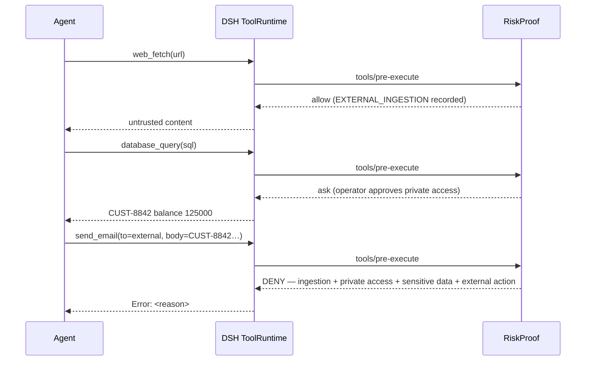

# RiskProof

**Stop sensitive data from leaving through AI tools, and see where it came from.**

RiskProof tracks cross-tool data flows and blocks sensitive tool output in DeepSeek Harness.
A persistent security beacon shows redacted execution receipts. Deterministic rules need no extra LLM calls.

[English](README.md) · [简体中文](README.zh-CN.md)

## Quick Start

Requires Node.js 22.19+, with DSH and pnpm installed:

```bash
dsh plugin --profile web add dsh-riskproof@0.5.0
dsh --profile web --dump-config
```

Confirm the output includes `name: dsh-riskproof`, restart the Web profile, and click
its security beacon. Then enter this directly in the conversation composer:

```text
/riskproof demo
```

Four isolated rehearsals show web content influencing a command, customer data transfer,
a tool schema change and a read-only restriction. They use synthetic inputs, read no private files, run no shell commands,
send no email, and do not enter live protection counts. RiskProof's rules and direct slash
commands make no extra model calls; ordinary DSH model usage keeps its normal cost.

See [installation and troubleshooting](docs/installation.md) for the complete steps.

| Compatibility | Verified scope |
| --- | --- |
| Node.js | 22.19+; see the [CI matrix](.github/workflows/ci.yml) |
| DSH | Install/tool pipeline: 0.1.0-rc.7 and 0.1.2-rc.1; Web acceptance: 0.1.2-rc.1 |
| Model | Deterministic rules need no reviewer model or additional API key |
| Language | Beacon, overview and reports: `experience.language: en` or `zh-CN` (default) |

Newer DSH versions require separate verification. See [validation evidence](docs/v0.3-validation.md)
for the tested versions above.

## Start here

| Goal | Read |
| --- | --- |
| Install and try it | [Quick Start](#quick-start) · [Installation](docs/installation.md) |
| Tune protection and task scope | [Configuration](docs/configuration.md) |
| Understand or contribute to the project | [Architecture](docs/architecture.md) · [Development](docs/development.md) |
| Push code or publish a version | [Manual release guide (中文)](docs/releasing.zh-CN.md) |
| Find security boundaries and version records | [Documentation index](docs/README.md) |

---

## See protection beside your conversation

A persistent **RiskProof security beacon** sits beside the DSH conversation. Ordinary tool
calls update it automatically. Click to open a compact overview; activity never opens it for you.


- Waits honestly for tool activity; there is no continuous simulated scan.
- Shows pending execution receipts and briefly acknowledges newly checked calls.
- Displays a call-distribution ring, the last 24 checks and up to three recent risk chains.
- Follows the selected conversation and removes stale charts when its connection is unavailable.
- Separates initial sync from disconnection, offers manual reconnect, and displays task scope and record limits.


*Real DSH Web screenshots; a local test model produced these records through the actual
Agent/tool pipeline. Normal use does not require a rehearsal.*

The chart counts calls with no triggered risk, calls blocked by RiskProof, and calls needing
attention. It does not invent a safety score. Observe mode, disabled recording and disabled
detection features are identified. Counts cover retained records in the current plugin run.
Not triggering a rule does not establish that an operation is safe.

Commands remain secondary entries; long output is collapsed by default:

| Need | DSH command |
| --- | --- |
| Open the compact overview | `/riskproof` |
| Check protection settings and next steps | `/riskproof doctor` |
| Read the text provenance report | `/riskproof trace` |
| Restrict to inspection | `/riskproof task read-only` |
| Keep tool capabilities local | `/riskproof task local-only` |
| Restore ordinary task scope | `/riskproof task standard` |
| Optional isolated rehearsals | `/riskproof demo` |

The model can also call the read-only `riskproof_report` tool. The beacon reads redacted
statistics through DSH's authenticated connection about once per second while the page is
visible. It makes no model requests and creates no tool records. The beacon, overview and command/tool text follow
`experience.language`: `zh-CN` (default) or `en`.

## See configuration gaps and what to do next

Expand **Protection checks** in the beacon overview, or run `/riskproof doctor` to inspect
execution mode, evidence recording, provenance, label propagation, chain detection,
credential output protection and effective rule posture. Explicit overrides that relax a
strict preset remain visible. Recent risk cards also explain the next step.
These are read-only configuration checks, with no test tool dispatch, credential reads or
extra activity counts. See the [protection checks guide](docs/protection-checks.md).

## What RiskProof answers

Most tool-permission plugins answer one question: *is this tool allowed?*

RiskProof answers a different one:

> **Where did the data in this tool call come from, what did it flow through, and where is it about to go?**

A single tool call is usually safe. The composition is not.

```text
web_fetch          ← UNTRUSTED_WEB
   │
database_query     ← CUSTOMER_DATA
   │
send_email         ← external destination
   │
RiskProof → DENY   (evidence-backed, before the side effect)
```

## Why RiskProof

| Tool-name allowlists      | RiskProof                              |
| ------------------------- | -------------------------------------- |
| Is this tool allowed?     | Where did this data come from?         |
| Single call               | Cross-tool flow                        |
| Tool name                 | Provenance + taint                     |
| Static rule               | Stateful attack chain                  |
| Permission decision       | Evidence-backed execution decision     |

RiskProof is a layer over the DSH Tool Runtime, not another Agent Runtime. It never re-implements tool dispatch, approval, or lifecycle — it observes and decides.

## Local build and configuration

Alternatively, build a local package from the repository root:

```bash
# build and install from this checkout
npm ci
mkdir -p artifacts
npm pack --pack-destination artifacts
dsh plugin --profile web add ./artifacts/dsh-riskproof-0.5.0.tgz

# confirm the bundled patch was composed
dsh --profile web --dump-config
```

The package declares a DSH bundle, so `plugin add` composes its `riskproof` row automatically. No second install or manual row is required. Restart the profile to see the beacon, then click it to inspect the current conversation.

The current version is **0.5.0**. See [installation and update instructions](docs/installation.md). Installation, SDK host startup,
commands and tool execution have been verified on DSH 0.1.0-rc.7 and 0.1.2-rc.1.
Chrome desktop and narrow-viewport Web acceptance also passed on DSH 0.1.2-rc.1,
including provenance and read-only denials through the real Agent loop with a local
simulated model. See [validation evidence](docs/v0.3-validation.md).

To tune it, override the bundled row from the profile's later `cordis.patch.yml` layer:

```yaml
- id: riskproof
  config:
    experience:
      language: en           # zh-CN (default) | en; beacon and reports
    mode: enforce            # enforce | observe
    policy:
      preset: balanced         # permissive | balanced | strict
      internalDomains: [acme.internal]
      blockedDomains: [collector.evil.example]
      # allowedExternalDomains: [api.approved.example]
    classification:
      overrides:
        gmail_send: [EXTERNAL_ACTION]
        company_db: [PRIVATE_ACCESS]
    output:
      blockedTaints: [SECRET, API_KEY]
      # trustedDeclassifiers: { approved_redactor: [PII] }
```

See [docs/configuration.md](docs/configuration.md) for the full reference.

## See it work



The same flow is reproduced as a deterministic regression test in [tests/security/attack-chain.test.ts](tests/security/attack-chain.test.ts).

Try it locally with no model or profile — a real DSH ToolRuntime pipeline with three mock tools:

```bash
npm run demo
```

See [demo/README.md](demo/README.md).

## Features

### Track data origin

Know where tool inputs came from. RiskProof maps arguments back to the tool results that produced them.

### Follow sensitive data

Carry security labels — `UNTRUSTED_WEB`, `CUSTOMER_DATA`, `PII`, `SECRET`, … — across tool calls, additively.

### Control sensitive output

Inspect model-facing results in `tools/post-execute`; block `SECRET` and `API_KEY` output by default before it enters model context.

### Declassify through pinned tools

Let exact operator-approved tools remove selected inherited labels. Labels detected in the returned value are always restored, so a redactor must actually remove the sensitive data.

### Detect attack chains

Identify the `EXTERNAL_INGESTION → PRIVATE_ACCESS → EXTERNAL_ACTION` pattern that single-tool checks miss.

### Stop before execution

Block or ask *before* the side effect runs, through the native `tools/pre-execute` gate.

### Guard sensitive surfaces

Gate credential-file paths, high-confidence destructive commands, download-and-execute pipelines, blocked destinations, and credentials embedded in network-capable commands.

### Adapt without rewriting rules

Start with the default `balanced` preset, roll out with `permissive`, or use `strict`; every configurable decision can still be overridden individually.

### Explain every decision

Generate structured, privacy-preserving security evidence and actionable remediation for every decision. Keep proofs in memory or append them to an operator-controlled JSONL file.

## How it works

RiskProof hooks the native DSH tool pipeline:

```text
tools/pre-execute
    │  capability classification
    │  argument provenance mapping
    │  taint analysis
    │  toolchain state (EIT → PAT → NAT)
    │  deterministic policy evaluation
    ▼
allow / ask / deny   (monotonic with other plugins)
    │
tool execute
    │
tools/post-execute
    │  output taint evaluation
    │  trusted declassification
    ▼
accept / block
    │
tools/result
    │  update ContextTracker
    │  update Toolchain state
    ▼  record execution evidence
```

- **Classification** is deterministic (tool name + description + schema), configurable, and never uses an LLM.
- **Provenance** uses exact and bounded substring matching over a per-session context index.
- **Taint** is additive; only an exact operator-approved declassifier can remove selected inherited labels.
- **Decisions** are deterministic, explainable, and testable.

See [docs/architecture.md](docs/architecture.md).

## Security boundaries

RiskProof protects **supported observable tool-call flows** through DSH:

- DSH tool calls through the supported `tools/pre-execute` / `tools/post-execute` / `tools/result` paths
- supported observable provenance (exact / bounded substring matching)
- configured sensitive flows and cross-tool attack patterns

RiskProof does **not** replace:

- OS sandbox / process isolation
- network firewall / SSRF protection
- endpoint security / malware scanning
- credential vaults
- full semantic DLP

See [docs/security-model.md](docs/security-model.md) for the complete threat model and known limitations.

## Documentation

See the [documentation index](docs/README.md) for guides, security design and version records.

- **Use**: [Installation](docs/installation.md) · [Configuration](docs/configuration.md) · [Web acceptance](docs/web-acceptance.zh-CN.md)
- **Develop**: [Architecture](docs/architecture.md) · [Development](docs/development.md)
- **Security**: [Security model](docs/security-model.md) · [Provenance & taint](docs/provenance.md) · [Toolchain](docs/toolchain.md)

## Roadmap

### v0.2 (delivered)

- DSH-native runtime (`tools/pre-execute`, `tools/result`)
- Provenance + taint tracking
- Cross-tool EIT → PAT → NAT detection
- Privacy-preserving proof with optional JSONL persistence
- Policy presets, sensitive-path gates, deterministic command-risk checks, and egress domain policy
- Remediation guidance and per-rule proof statistics

### v0.3 (delivered)

- Native security receipts, provenance timeline, bilingual reports and safe rehearsals
- Tool metadata continuity: description and input/output schema fingerprints
- Operator-selected task contracts: standard / read-only / local-only
- Execution-token correlation between policy gates and final results
- Taint inheritance through intermediate tools; bounded, isolated session state

### v0.4 (current)

- Output-side information-flow control before results reach model context
- Default credential-output blocking with configurable label selection
- Exact-name trusted declassifiers with deterministic re-tainting
- Redacted output-control and declassification receipts

### Later

- Richer structured/semantic DLP adapters
- Cross-process provenance with explicit trust boundaries

## Choosing alongside auto-review

| Need | Direction |
| --- | --- |
| A second model evaluates whether an approval request should proceed | [dsh-auto-review](https://github.com/PerryLink/dsh-auto-review) |
| Track cross-tool data flows, block sensitive output and inspect execution receipts | RiskProof |

These use different host hooks. Joint use still needs plugin-order and host-version testing;
combined acceptance has not been verified. RiskProof covers observable, matchable flows and
configured rules; see the [security model](docs/security-model.md).

## Contributing

Issues, rule submissions, tool-capability mappings, and false-positive reports are welcome. See [CONTRIBUTING.md](CONTRIBUTING.md).

If RiskProof helps you, a [GitHub star](https://github.com/onlyqzq/dsh-riskproof) helps others discover it.
Installation feedback, redacted false-positive reports and tool mappings help improve it too.

## Security reporting

Please report vulnerabilities privately. See [SECURITY.md](SECURITY.md).

## License

[Apache-2.0](LICENSE)
