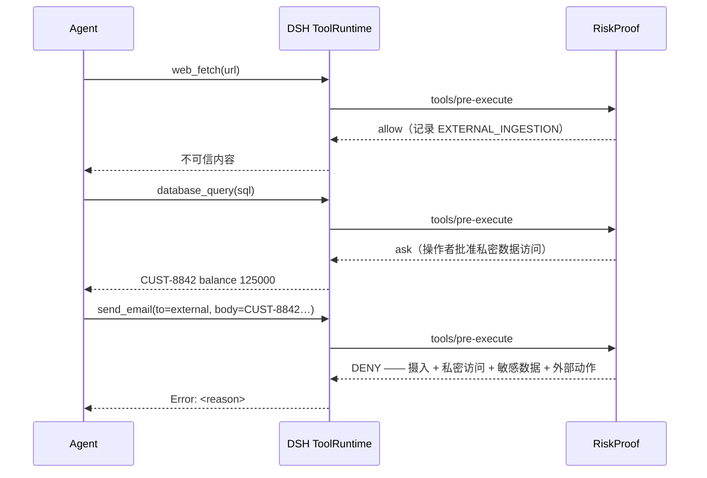

# RiskProof

**在 AI 工具把敏感数据发出去之前拦截，并看清来源与执行结果。**

RiskProof 为 DeepSeek Harness 追踪跨工具数据流、拦截敏感工具输出，
通过常驻安全浮标展示脱敏回执；确定性规则决策不需要额外 LLM 调用。

[English](README.md) · [简体中文](README.zh-CN.md)

## 快速开始

需要 Node.js 22.19+，并已安装 DSH 和 pnpm：

```bash
dsh plugin --profile web add dsh-riskproof@0.5.0
dsh --profile web --dump-config
```

确认输出包含 `name: dsh-riskproof`，重启 Web profile，再点击对话旁的安全浮标。
随后在对话输入框直接输入：

```text
/riskproof demo
```

四项隔离演练展示网页内容影响命令、客户数据外发、工具 schema 变化和只读限制，使用合成数据，
不读私密文件、不执行 shell、不发送邮件，也不计入真实防护统计。RiskProof 的规则引擎和
原生命令不调用额外模型。日常任务中仍使用 DSH 原有的模型配置与计费。

完整步骤与排障见 [安装指南](docs/installation.md)。

| 兼容性 | 已验证范围 |
| --- | --- |
| Node.js | 22.19+；具体 CI 矩阵见 [工作流](.github/workflows/ci.yml) |
| DSH | 安装与工具管线：0.1.0-rc.7、0.1.2-rc.1；Web 验收：0.1.2-rc.1 |
| 模型 | 确定性规则引擎不需要审查模型或额外 API key |
| 语言 | 浮标、概览与报告支持中文／英文：`experience.language: zh-CN` 或 `en` |

较新 DSH 版本需要另做兼容性验证。以上版本对应的证据见 [验收记录](docs/v0.3-validation.md)。

## 从这里开始

| 你的目标 | 入口 |
| --- | --- |
| 安装并开始使用 | [快速开始](#快速开始) · [安装与首次使用](docs/installation.md) |
| 调整防护模式、规则和任务范围 | [配置参考](docs/configuration.md) |
| 理解项目结构或参与开发 | [架构与模块职责](docs/architecture.md) · [开发指南](docs/development.md) |
| 手动推送代码或发布新版本 | [推送与发布流程](docs/releasing.zh-CN.md) |
| 查找验收记录、版本设计和安全边界 | [文档导航](docs/README.md) |

---

## 在对话旁，看见防护正在工作

安装后，DSH 右下方常驻 **RiskProof 安全浮标**。正常聊天无需输入任何命令：
工具调用发生后，浮标自动更新检查与拦截状态；点击浮标才展开安全概览。


- **空闲时待命**：等待真实工具调用，不播放持续扫描动画。
- **调用时反馈**：等待执行回执时显示工作状态，新检查完成后短暂反馈。
- **风险可追溯**：点击查看调用分布圆环、最近 24 次活动及最多 3 条风险来源链。
- **会话独立**：切换对话立即切换记录；连接中断时隐藏旧图表并提示等待同步。
- **状态明确**：首次同步、断线重连分别提示；概览显示任务范围和统计边界，断线时可手动重连。


*真实 DSH Web 界面；截图数据由本地测试模型驱动真实工具管线产生。插件日常使用无需模拟演练。*

图表展示“未触发风险 / RiskProof 拦截 / 需要关注”，不生成安全评分。
观察模式明确显示“不主动拦截”；记录关闭或部分检测停用时也会提示。
统计仅覆盖本次运行仍保留的当前会话记录，未触发规则不等于绝对安全。

以下命令保留为辅助入口；完整文字默认折叠，日常使用直接点击浮标即可。

| 需要做什么 | DSH 命令 |
| --- | --- |
| 打开安全概览 | `/riskproof` |
| 检查配置缺口与处理建议 | `/riskproof doctor` |
| 查看文字来源记录 | `/riskproof trace` |
| 限制为只读任务 | `/riskproof task read-only` |
| 限制为本地任务 | `/riskproof task local-only` |
| 恢复常规任务范围 | `/riskproof task standard` |
| 可选的四项模拟演练 | `/riskproof demo` |

也可让模型调用 `riskproof_report` 查看原生工具结果卡。浮标通过 DSH 自带的认证连接读取
脱敏统计，页面可见时约每秒更新，不调用模型、不增加工具记录、不消耗模型 token。
浮标与报告统一遵循 `experience.language`（默认 `zh-CN`，可设为 `en`）。

## 看清配置缺口，知道下一步怎么做

点击浮标后展开“防护检查”，或运行 `/riskproof doctor`：查看当前执行模式、证据记录、
来源匹配、敏感标签传播、工具链检测、凭据输出保护和有效规则强度。
即使预设为 strict，显式覆盖放宽了规则也会提示；风险卡片同时显示处理建议。
检查只读、不执行测试工具、不读取真实凭据，也不增加调用计数。
完整说明见 [防护检查指南](docs/protection-checks.md)。

## RiskProof 回答的问题

大多数工具权限插件只回答一个问题：*这个工具允许调用吗？*

RiskProof 回答另一个问题：

> **这次工具调用里的数据从哪里来、经过了哪些工具、现在准备流向哪里？**

单次工具调用通常安全，但组合起来就不一定了。

```text
web_fetch          ← UNTRUSTED_WEB
   │
database_query     ← CUSTOMER_DATA
   │
send_email         ← 外部目的地
   │
RiskProof → DENY   （有证据、在副作用发生之前）
```

## 为什么是 RiskProof

| 工具名称白名单                  | RiskProof                        |
| ------------------------- | -------------------------------- |
| 这个工具允许吗？          | 这些数据从哪里来？               |
| 单次调用                  | 跨工具数据流                     |
| 工具名                    | 来源（Provenance）+ 污点（Taint）|
| 静态规则                  | 有状态的攻击链                   |
| 权限决策                  | 有证据支撑的执行决策             |

RiskProof 是 DSH Tool Runtime 之上的一层安全策略，而不是另一套 Agent Runtime。它从不重复实现工具分发、审批或生命周期——它只观察并裁决。

## 本地构建与配置

也可在本仓库根目录构建本地安装包：

```bash
# 在本仓库中构建并安装
npm ci
mkdir -p artifacts
npm pack --pack-destination artifacts
dsh plugin --profile web add ./artifacts/dsh-riskproof-0.5.0.tgz

# 确认包内 patch 已被组合
dsh --profile web --dump-config
```

该包声明了 DSH bundle，`plugin add` 自动组合 `riskproof` 行。重启该 profile 后，即可看到常驻安全浮标；点击查看当前对话概览。支持原生命令的界面也可通过 `/` 搜索 RiskProof。

当前版本为 **0.5.0**。完整步骤见 [安装与更新](docs/installation.md)。
已验证 DSH 0.1.0-rc.7 与 0.1.2-rc.1 的安装、SDK 宿主启动、命令和工具管线；DSH 0.1.2-rc.1 的 Chrome 桌面与窄屏 Web 验收已通过，含真实 Agent 工具管线的来源拦截和只读拦截（本地模拟模型驱动）。详见 [验收记录](docs/v0.3-validation.md) 和 [Web 操作步骤](docs/web-acceptance.zh-CN.md)。

如需调整，可在随后加载的 profile `cordis.patch.yml` 中覆盖 bundle 行：

```yaml
- id: riskproof
  config:
    experience:
      language: zh-CN        # zh-CN | en（同时控制浮标和报告）
    mode: enforce            # enforce | observe
    policy:
      preset: balanced         # permissive | balanced | strict
      internalDomains: [acme.internal]
      blockedDomains: [collector.evil.example]
      # allowedExternalDomains: [api.approved.example]
    classification:
      overrides:
        gmail_send: [EXTERNAL_ACTION]
        company_db: [PRIVATE_ACCESS]
    output:
      blockedTaints: [SECRET, API_KEY]
      # trustedDeclassifiers: { approved_redactor: [PII] }
```

完整配置参考见 [docs/configuration.md](docs/configuration.md)。

## 效果演示


```mermaid
sequenceDiagram
    participant A as Agent
    participant T as DSH ToolRuntime
    participant R as RiskProof

    A->>T: web_fetch(url)
    T->>R: tools/pre-execute
    R-->>T: allow（记录 EXTERNAL_INGESTION）
    T-->>A: 不可信内容

    A->>T: database_query(sql)
    T->>R: tools/pre-execute
    R-->>T: ask（操作者批准私密数据访问）
    T-->>A: CUST-8842 balance 125000

    A->>T: send_email(to=external, body=CUST-8842…)
    T->>R: tools/pre-execute
    R-->>T: DENY —— 摄入 + 私密访问 + 敏感数据 + 外部动作
    T-->>A: Error: <reason>
```

同样的流程被做成确定性的回归测试，见 [tests/security/attack-chain.test.ts](tests/security/attack-chain.test.ts)。

无需配置模型或 DSH profile，也可以在安装依赖后运行本地演示：

```bash
npm run demo
```

演示通过真实 DSH 工具管线运行三个模拟工具，见 [演示说明](demo/README.md)。

## 功能

### 追踪数据来源

知道工具输入从哪里来。RiskProof 会把参数映射回产生它们的工具结果。

### 跟随敏感数据

让安全标签——`UNTRUSTED_WEB`、`CUSTOMER_DATA`、`PII`、`SECRET` 等——以加法方式跨工具传播。

### 控制敏感输出

在 `tools/post-execute` 检查模型可见的工具结果；默认在结果进入模型上下文前拦截 `SECRET` 与 `API_KEY`。

### 通过固定工具可信降密

只有操作者按精确名称批准的工具才能移除指定继承标签。结果正文若仍命中敏感特征，标签会被重新加回，因此降密工具必须真正移除敏感数据。

### 发现攻击链

识别 `EXTERNAL_INGESTION → PRIVATE_ACCESS → EXTERNAL_ACTION` 这一单工具检查发现不了的模式。

### 在副作用前拦截

通过原生 `tools/pre-execute` 门，在副作用执行前拦截或询问。

### 保护敏感操作面

在执行前检查凭据文件路径、高置信破坏性命令、下载后直接执行的管道、被阻止的目的地，以及网络命令中携带的凭据。

### 按场景调整策略

默认使用 `balanced`，初次上线可选 `permissive`，高安全环境可选 `strict`；每个可配置裁决仍可单独覆盖。

### 解释每一次决策

为每一次裁决生成结构化、保护隐私的安全证据和可执行处置建议；proof 既可保留在内存中，也可追加到操作者管理的 JSONL 文件。

## 工作原理

RiskProof 接入原生 DSH 工具管线：

```text
tools/pre-execute
    │  能力分类
    │  参数来源映射
    │  污点分析
    │  工具链状态（EIT → PAT → NAT）
    │  确定性策略评估
    ▼
allow / ask / deny   （与其他插件单调合并）
    │
工具执行
    │
tools/post-execute
    │  输出污点评估
    │  可信降密
    ▼
accept / block
    │
tools/result
    │  更新 ContextTracker
    │  更新工具链状态
    ▼  记录执行证据
```

- **分类**是确定性的（工具名 + 描述 + schema）、可配置的，且从不使用 LLM。
- **来源追踪**使用精确和带边界的子串匹配，基于每个会话的上下文索引。
- **污点**是加法的；只有操作者精确批准的降密工具可移除指定继承标签。
- **决策**是确定性、可解释、可测试的。

详见 [docs/architecture.md](docs/architecture.md)。

## 安全边界

RiskProof 保护的是 DSH 中**可观测的工具调用流**：

- 经过 `tools/pre-execute` / `tools/post-execute` / `tools/result` 支持路径的 DSH 工具调用
- 可观测的来源追踪（精确 / 带边界子串匹配）
- 配置的敏感数据流与跨工具攻击模式

RiskProof **不能替代**：

- OS 沙箱 / 进程隔离
- 网络防火墙 / SSRF 防护
- 端点安全 / 恶意软件扫描
- 凭据保险库
- 完整语义 DLP

完整威胁模型与已知局限见 [docs/security-model.md](docs/security-model.md)。

## 文档

完整目录见 [文档导航](docs/README.md)，按使用、开发、安全设计和版本记录分组。

- **使用**：[安装](docs/installation.md) · [配置](docs/configuration.md) · [Web 验收步骤](docs/web-acceptance.zh-CN.md)
- **开发**：[架构](docs/architecture.md) · [开发指南](docs/development.md)
- **安全**：[安全模型](docs/security-model.md) · [来源与污点](docs/provenance.md) · [工具链](docs/toolchain.md)

## 路线图

### v0.2（已完成）

- DSH 原生运行时（`tools/pre-execute`、`tools/result`）
- 来源 + 污点追踪
- 跨工具 EIT → PAT → NAT 检测
- 保护隐私、可选 JSONL 持久化的 proof
- 策略预设、敏感路径门控、确定性危险命令检测和出口域名策略
- 处置建议与按规则聚合的 proof 统计

### v0.3（已完成）

- 原生安全账单、来源时间线、无副作用演练与中英文报告
- 工具元数据身份连续性：描述、输入／输出 schema 变化时拒绝
- 操作者设定的任务约束：standard / read-only / local-only
- 按执行 token 关联门控与最终结果的回执
- 中间工具结果继承敏感标签；会话隔离与有界状态

### v0.4（当前版本）

- 在结果进入模型上下文前执行输出侧信息流控制
- 默认拦截凭据输出，并允许配置需拦截的标签
- 按精确工具名配置可信降密，结果仍敏感时确定性重新加标
- 在回执中记录脱敏后的输出控制与降密信息

### 后续

- 更丰富的结构化／语义 DLP 适配
- 带显式信任边界的跨进程来源追踪

## 与自动审批插件如何选择

| 需求 | 更合适的方向 |
| --- | --- |
| 让第二个模型根据上下文判断一次审批能否放行 | [dsh-auto-review](https://github.com/PerryLink/dsh-auto-review) |
| 追踪数据跨工具流动、阻止敏感输出、查看执行回执 | RiskProof |

两者工作在不同钩子上；联合使用仍需验证插件顺序与 DSH 版本，当前没有宣称完成组合验收。
RiskProof 仅对可观测、可匹配的数据流和已配置规则作判断，完整边界见 [安全模型](docs/security-model.md)。

## 贡献

欢迎提交 Issue、规则、工具能力映射和误报报告。见 [CONTRIBUTING.md](CONTRIBUTING.md)。

如果 RiskProof 对你有帮助，欢迎 [Star 项目](https://github.com/onlyqzq/dsh-riskproof)；
安装反馈、脱敏误报案例和工具分类贡献同样有助于改进。

## 安全报告

请私下报告漏洞。见 [SECURITY.md](SECURITY.md)。

## License

[Apache-2.0](LICENSE)
