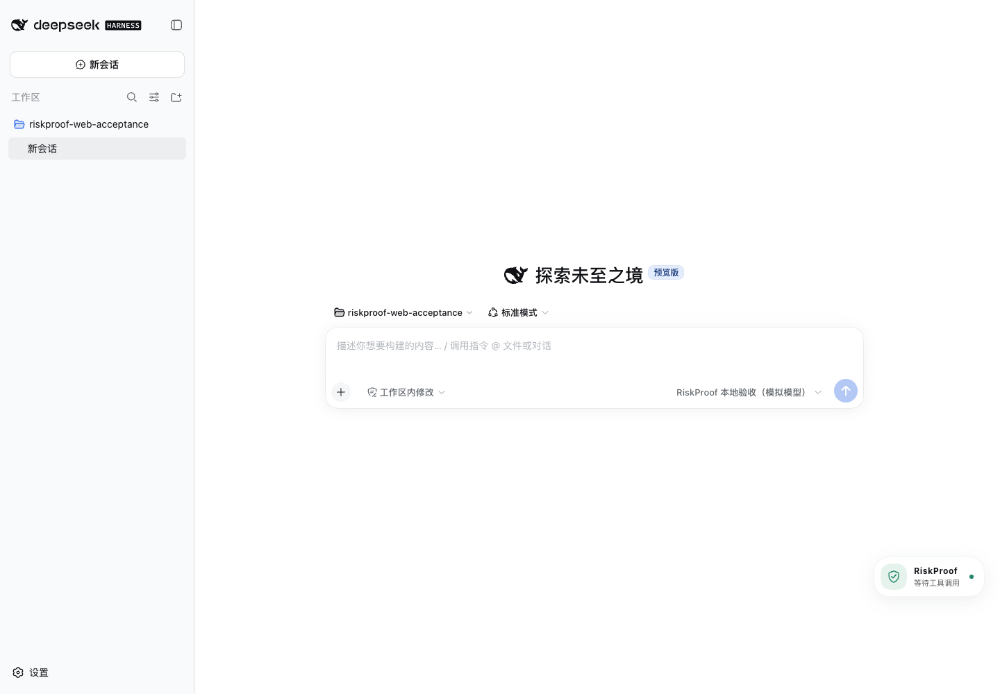
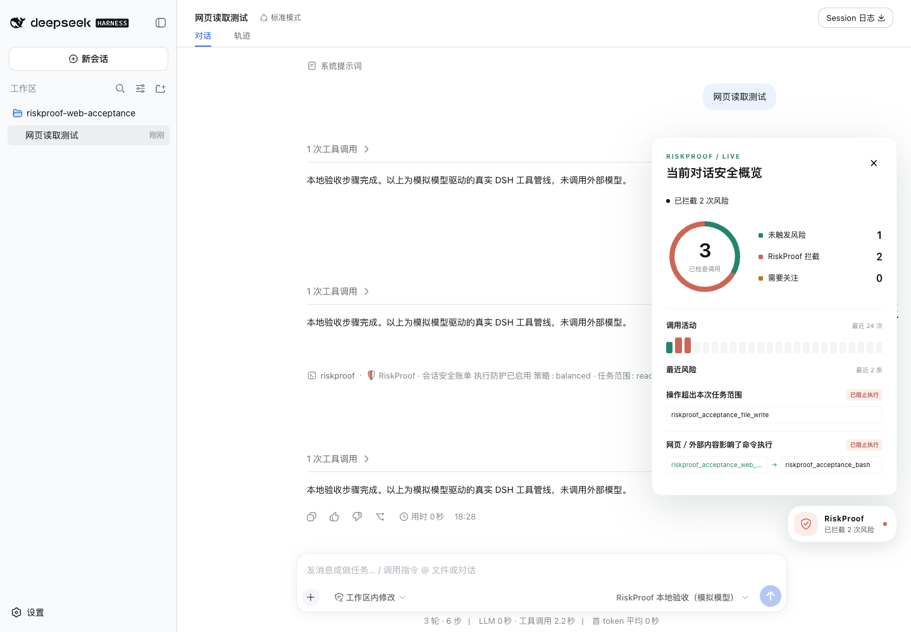
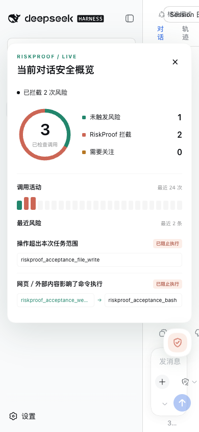

# RiskProof Web 浮标界面验收

当前界面是常驻安全浮标，点击后才展开图表概览。日常使用不需要命令或模拟演练。
本页为当前版本的操作清单；截图和此前在 macOS、DSH 0.1.2-rc.1、Chrome 152
上的验证详情见 [v0.3 验收记录](v0.3-validation.md)。

## 安装与打开

在仓库目录执行：

```bash
npm ci
mkdir -p artifacts
npm pack --pack-destination artifacts
# 每次验收用新目录，避免相同路径的 tarball 被缓存。
export DSH_HOME="$(mktemp -d /tmp/riskproof-web-review.XXXXXX)"
dsh plugin --profile web add "$PWD/artifacts/dsh-riskproof-0.5.0.tgz"
dsh --profile web --no-open --port 19843
```

若端口已占用，换一个端口。打开终端打印的完整地址，保留 `?token=...`。
首次欢迎页点击“继续”，选择测试工作区。仅查看浮标和空状态不需要配置模型。
这里的 DSH_HOME 仅影响当前终端，不改动原来的 profile 和 API Key。

## 首次体验

1. 页面右下方应出现 RiskProof 浮标，默认收起，没有模态弹窗。
2. 未产生工具调用时，显示“等待工具调用”，不能显示正在扫描。
3. 点击浮标，展开“当前对话安全概览”：0 次检查、空活动条、等待第一条记录。
4. 点击 ×、再次点击浮标、点击外部或按 Escape 均可收起。输入框保持可用。
5. 首次读取和切换会话时显示“正在同步当前对话”；未选择会话时提示“请选择对话”。
6. 概览显示当前任务范围、防护模式和记录上限；切换任务范围后应同步更新。



## 日常调用与风险

配置模型后进行普通任务，浮标无需命令会自动更新。测试环境可运行
`npm run check:web`，由独立 profile 中的本地模拟模型确定性地触发真实工具管线：

| 情况 | 浮标与概览应有的行为 |
| --- | --- |
| 工具执行中，尚未收到回执 | 显示“工具执行中，等待回执”，出现活动指示 |
| 检查完成 | 短暂反馈新的检查；随后恢复待命或显示风险数量 |
| 网页内容传入命令工具 | 自动显示已拦截；展开后可见网页工具 → 命令工具来源链 |
| 只读任务尝试写入 | 自动增加拦截数；出现“操作超出本次任务范围” |
| 一次读取成功、两次拦截 | 圆环合计 3，未触发风险 1，RiskProof 拦截 2，成功回执 1 |
| 工具活动或风险发生 | 详情保持收起，不自动打断聊天 |
| 切换新会话 | 立即清空上一会话数据，显示新会话的记录 |
| RPC 连接失效 | 提示连接中断，隐藏旧图表；可点击“重新连接”，请求期间按钮禁用，也会自动重试 |
| 敏感工具输出被拦截 | 标记“已拦截工具输出”，不能标记为“已阻止执行” |



*图为真实 DSH Web；截图中的模型与工具内容来自验收夹具。插件实际使用直接跟随用户任务。*

圆环展示调用分布，不是风险评分。活动条表示最近最多 24 次检查，灰色部分是空位，
不是已经扫描的安全项目。风险列表仅显示最近最多 3 条，来源名称过长时悬停查看。

## 辅助入口与边界

- `/riskproof`、`/riskproof trace`：打开概览，完整命令输出默认折叠。
- `/riskproof task read-only`、`local-only`、`standard`：操作者调整任务范围。
- `/riskproof demo`：可选模拟演练，不增加图表计数，不是默认产品入口。
- `riskproof_report`：模型可调用的只读报告，展开 DSH 工具行查看。
- 观察模式明确显示“不主动拦截”，不会把建议算作 RiskProof 的实际拦截。
- 关闭记录时显示“证据记录已关闭”，不再提示等待第一条记录；零条记录不能用来表示没有工具执行。
- 统计范围是本次服务运行仍保留的当前会话记录，不是历史累计安全承诺。

将浏览器缩窄到 390px，浮标收敛为盾牌按钮；展开概览应没有横向溢出、可以纵向滚动。



自动验收默认关闭浏览器与测试服务，保留截图及 `artifacts/web/acceptance.json`。
手动验收完成后，在启动 DSH 的终端按 Ctrl+C。自动检查不使用外部模型、真实凭据或危险操作。
